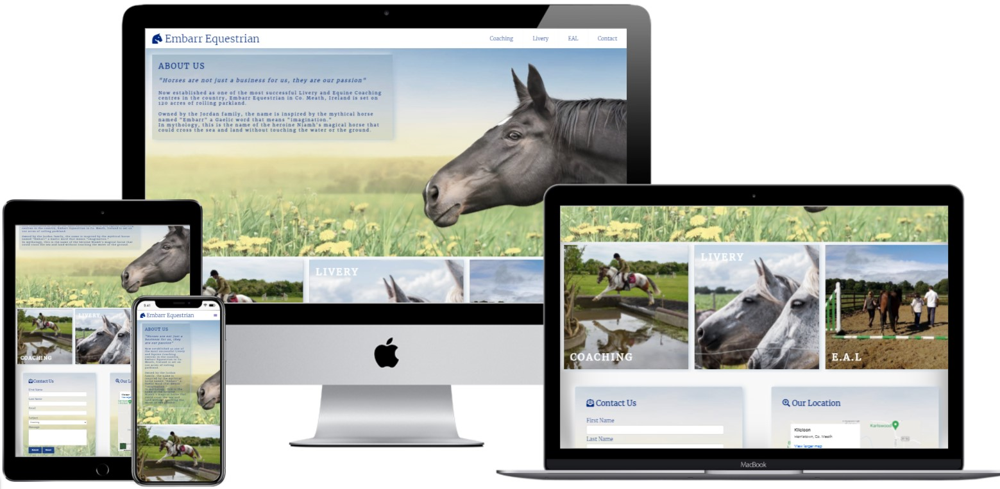

# Embarr Equestrian

## Overview

Embarr Equestrian is a website designed for an small equine business owner. The site is targeted at horse owners that need a boarding service for their horses or horse owners that require coaching/ lessons on their own horse. Embarr Equestrian also offers Equestrian Assisted Learning for people of all backgrounds, this targets a range of audiences, horsey people & non-horsey people that want to work on self development either in a one to one situation or as a group.

The site design was developed with mobile responsiveness at the forefront. It consists of four pages that all follow the same structured layout of a header, three sections and the footer: [Embarr Equestrian - Deployed Site Link](https://chellej80.github.io/Embarr-Equestrian/)

## The sites goals are:

* To attract new customers, 
* Highlight the benefits of what the business has to offer, 
* Provide contact & location information,
* Provide a great user experience on all mobile devices,
* Be easy to navigate
* Give clear calls to action
* Build the brand image
* Raise the conversion rate.

## Site Mockup

## Features 

### Header - Logo & Navigation Menu

Featured on all three pages, the full responsive navigation bar includes links to the Logo, Home page, Coaching, Livery, EAL Contact form and is identical in structure for each page to allow for easy navigation.
This section allows the user to easily navigate from page to page across all devices without having to revert back to the previous page via the ‘back’ button. 

- __Logo__

- __Navigation Bar__

- __The landing page hero image__

- __Image/ Gallery Section__

- __Information Section - Contact Form/ Location__

- __The Footer__ 

