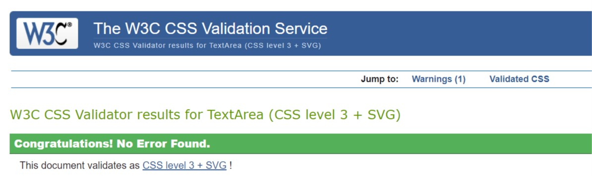
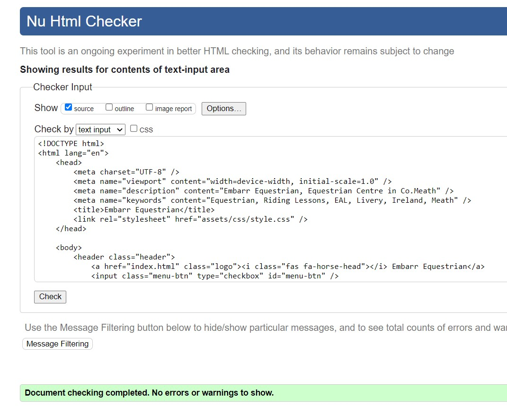
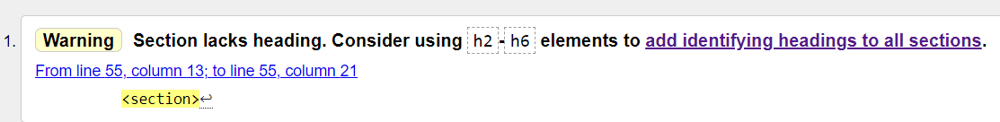

# Embarr Equestrian

## Overview

Embarr Equestrian is a website designed for an small equine business owner. The site is targeted at horse owners that need a boarding service for their horses or horse owners that require coaching/ lessons on their own horse. Embarr Equestrian also offers Equestrian Assisted Learning for people of all backgrounds, this targets a range of audiences, horsey people & non-horsey people that want to work on self development either in a one to one situation or as a group.

The site design was developed with mobile responsiveness at the forefront. It consists of four pages that all follow the same structured layout of a header, three sections and the footer: [Embarr Equestrian - Deployed Site Link](https://chellej80.github.io/Embarr-Equestrian/)

<h2>
Site Mockup
</h2>

## The sites goals are:

* To attract new customers, 
* Highlight the benefits of what the business has to offer, 
* Provide contact & location information,
* Provide a great user experience on all mobile devices,
* Be easy to navigate
* Give clear calls to action
* Build the brand image
* Raise the conversion rate.

## User Stories

## Features 

### The Header Section

- __Navigation Bar__

  Featured on all three pages, the full responsive navigation bar includes links to the Logo, Home page and three sub pages - Coaching, Livery, EAL page and is identical in structure for each page to allow for easy navigation. When the user hovers over a one of the menu items it is highlighted. The navigation items are styled to transition to a hamburger menu when the site is reduced in size on a mobile device. This section will allow the user to easily navigate from page to page across all devices without having to revert back to the previous page via the ‘back’ button. 

- __Logo__

    The logo I created simply using a combination of text and a font awsome icon. The logo is a hyperlink that takes the user to the homepage.
    

- __The landing page hero image__

The landing page includes a hero image of a horse with a text overlay 'About Us' to allow the user to quickly see exactly what the site is about.
This section introduces the user to Embarr Equestrian with an eye catching hero image to grab their attention.

Each sub page - Coaching, Livery, EAL also have the same hero image in an opaque verision that also contains text overlay to allow the user to quickly ascertain what the service offered is and how to follow up with the business owner to discuss. 

- __Image/ Gallery Section__

This section on the landing page contains three clickable linked Images with text. Each image represents one of the sub pages - Coaching, Livery and EAL, each image has a box shadow & pop effect that emphasises to the user when they hover on them that they are interactive hyperlinks.

For the three sub pages - Coaching, Livery & EAL this section is displayed as a manual slideshow gallery to showcase some of the activies Embarr Equestrian offers. The gallery has numbers in the top right corner so the user can see how many slides there are, the next & previous arrows have a hover effect.

- __Information Section - Contact Form/ Location__

- On the landing page this section is divided into two parts - the contact form will allow the user to submit a message to the business owner. All fields are set to required & the form when submitted will diplay the code institute form dump page.

- The location part of this section allows the user to interact with an embedded google map to locate the business. 

- The information sections for the three subpages is slightly different. For these pages the section contains an embedded youtube video & a testimonial block related to the page topic.

- __The Footer__ 

    - The footer section includes links to the relevant social media sites (Facebook, Twitter, youtube, Instagram) for Embarr Equestrian. The links will open to a new tab to allow easy navigation for the user. 
    - The footer is valuable to the user as it encourages them to keep connected via social media
    

### Features Left to Implement
- Additional features 
    - would be a booking form for events/ coaching/ EAL sessions and a pay online function.
    - A dedicated 404 page 
    - An automated slideshow of testimonials.
    - A shop selling Embarr Equestrian branded merchadise

## Languages Used

- HTML
- CSS
- Javascript

## Frameworks, Libaries and technologies used

- [Git/ Github](https://github.com/) - Git/Github was used for version control, storage and deployment of the project.
- [Font awesome](https://fontawesome.com/) - Font awesome icons were used throughout the site and for the logo creation.
- [Google Fonts](https://fonts.google.com/) - Were used to import the Merriweather font used throughout the site.
- [Font awesome](https://fontawesome.com/)
- [Hover: CSS](https://www.w3schools.com/cssref/sel_hover.asp) - Was used to created the pop effect for the linked three images on the landing page and the colour hover effect in navigation menu & slideshow next/prev arrows.
- [Javascript](https://www.w3schools.com/w3css/w3css_slideshow.asp) - JS script was used to action the manual slideshow function.
- [Squoosh](https://squoosh.app/) - This was used to prepare the images for web optimisation
- [Photojoiner](https://www.photojoiner.net/) - This was used to join multiple images together for the gallery slideshows on the three sub pages.
- [3D Paint](https://www.microsoft.com/en-us/p/paint-3d/9nblggh5fv99#activetab=pivot:overviewtab) - This was used to crop and add filters to the images.

## Testing Conducted 

### Usability testing 
I had work colleagues and family members assistance to test the site usability. The conclusion of this testing was that:
- All pages of the site were understandable and easy to use
- Buttons, links, and fields were convenient for use
- There is access to the Main navigation menu from all pages via the desktop version and mobile version.

### Content 

I reviewed all content on the site for:
- grammar and spelling mistakes
- Images are placed properly with proper sizes &    displaying as expected
- Instructions are clear and contain correct information
- Verified all text/ headings are displaying correctly

### Navigation

I tested all the navigation functions via desktop and mobile/ ipad to ensure that they are functioning and linking to the correct pages.

### Links testing

I tested all the hyperlinked text/ images/ nav items to ensure that there were no broken links and that they were linking to the correct locations on the site and/or opening in a new window if expected.

### Effects Testing 

I tested that all hover effects were working for the nav menu/ the image text overlay/ the slideshow arrows.

### Slideshow Gallery 

I tested the slideshow Gallery function on all three sub pages to ensure that they were functioning as expected in Desktop/ mobile/ ipad

### Responsiveness

I used chrome developer tools, [Techsini](http://techsini.com/multi-mockup/index.php) & [ami](http://ami.responsivedesign.is/#) throughout all development of the site to ensure that it was responding to all devices down to 300px - 360px width

I tested the site responsiveness on my iphone/ ipad and my family/ friends android mobile devices to ensure the site was rendering and functional across a range of devices.

### Performance

I ran the site through the lighthouse performance tool for developers: 
[Lighthouse](https://developers.google.com/web/tools/lighthouse)

Given more time I would look at the passive listeners to improve scrolling performance, and also the images/ youtube videos in order to improve the performance score

### CSS Code Validation
I ran the CSS Code through the follwoing validator:
[Jigsaw](https://jigsaw.w3.org/css-validator)

There were no errors detected

### HTML Code Validation

I ran the HTML Code through the follwoing validator:
[Jigsaw](https://jigsaw.w3.org/css-validator)

- Index Page results:

- Sub pages (Coaching/ Livery/EAL) results:
Some small errors were found but I fixed and tested again.
One small warning persists across these pages, if I had I would explore this further to resolve that section.

### Autoprefixer CSS

I ran the code through the [Autoprefixer] (https://autoprefixer.github.io/) and copied the parsed css back into my project.

### Unfixed Bugs

## Credits

### Header & Navigation: 
- [Responsive header & Navigation Menu](https://www.w3schools.com/howto/howto_js_topnav_responsive.asp) tutorial from W3schools.

### Hero Images: 

- Tutorials from [W3schools](https://www.w3schools.com/howto/howto_js_topnav_responsive.asp),  [Elementor](https://elementor.com/blog/hero-image/?utm_source=google&utm_medium=cpc&utm_campaign=11138809851&utm_term=&gclid=Cj0KCQiA2ZCOBhDiARIsAMRfv9JNeu2cN7Oh6WGv706wIViKg2tBoXlBjhg9Zw9Wkd9m3fQOmdY_Fp0aAtXIEALw_wcB) & from the [Love Runnning Module](https://learn.codeinstitute.net/courses/course-v1:CodeInstitute+LR101+2021_T1/courseware/4a07c57382724cfda5834497317f24d5/6fd29d155c3b42248ff57bae32978a4b/).  
- The image used was purchased from [Shutterstock](https://www.shutterstock.com/)  

### Responsiveness: 
- Tutorials & flexbox code adapted from [Flexfroggy](https://flexboxfroggy.com/), [W3schools](https://www.w3schools.com/howto/howto_css_responsive_text.asp
), [CSS tricks](https://css-tricks.com/snippets/css/a-guide-to-flexbox/), [CSS grid versus flexbox](https://webdesign.tutsplus.com/articles/flexbox-vs-css-grid-which-should-you-use--cms-30184), [Webdev](https://web.dev/responsive-web-design-basics/)

- Media Queries [W3schools](https://www.w3schools.com/css/css_rwd_mediaqueries.asp) & [Love Runnning Module](https://learn.codeinstitute.net/courses/course-v1:CodeInstitute+LR101+2021_T1/courseware/4a07c57382724cfda5834497317f24d5/6fd29d155c3b42248ff57bae32978a4b/)

### Contact Form
- Code adapted from [Mozilla](https://developer.mozilla.org/en-US/docs/Web/HTML/Element/form)

### Location - Google Map

- Code taken from [Google Maps](https://google-map-generator.com/)

### Footer

- Code adapted from [Eduonix](https://blog.eduonix.com/web-programming-tutorials/build-responsive-website-footer-using-html-css/), [Codepen](https://codepen.io/jakeduncan/pen/rJZJMM) & [Love Running Module](https://learn.codeinstitute.net/courses/course-v1:CodeInstitute+LR101+2021_T1/courseware/4a07c57382724cfda5834497317f24d5/6fd29d155c3b42248ff57bae32978a4b/). 

### Youtube Video

- Code & Html taken from [Youtube & w3schools](https://www.w3schools.com/html/html_youtube.asp)

### Hover/ Box Shadow Effects

- Code taken from [Mozilla](https://developer.mozilla.org/en-US/docs/Web/CSS/:hover) & [Box Shadow](https://getcssscan.com/css-box-shadow-examples)

### Lists 

- Code adapted from [w3schools](https://www.w3schools.com/tags/tag_ol.asp)

### Text Blocks

- Code adapted from [Mozilla](https://developer.mozilla.org/en-US/docs/Web/CSS/Containing_block
)

### Gallery Slideshow 

- Javascript code taken from [w3schools]((https://www.w3schools.com/w3css/w3css_slideshow.asp))

### Content

All content was written by the project owner

### Media

All images with the exception of the hero image (purchased from Shutterstock) are images taken by the project owner and her family     

# Deployment

- The site was deployed to GitHub pages. The steps to deploy are as follows: 
  - In the GitHub repository, navigate to the Settings tab 
  - From the source section drop-down menu, select the Master Branch
  - Once the master branch has been selected, the page will be automatically refreshed with a detailed ribbon display to indicate the successful deployment. 

  - On submission the project is forked to by forking the project I will make a copy of the original repository that can be viewed without affecting the original repository by following these steps: In the GitHun repository, locate the settings, above this is the option to 'fork', select this to create a copy

  - To create a clone in the repository select 'clone'

    

The live link can be found here - [Embarr Equestrian - Deployed Site Link](https://chellej80.github.io/Embarr-Equestrian/)